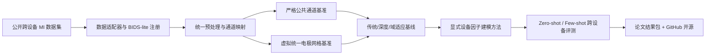
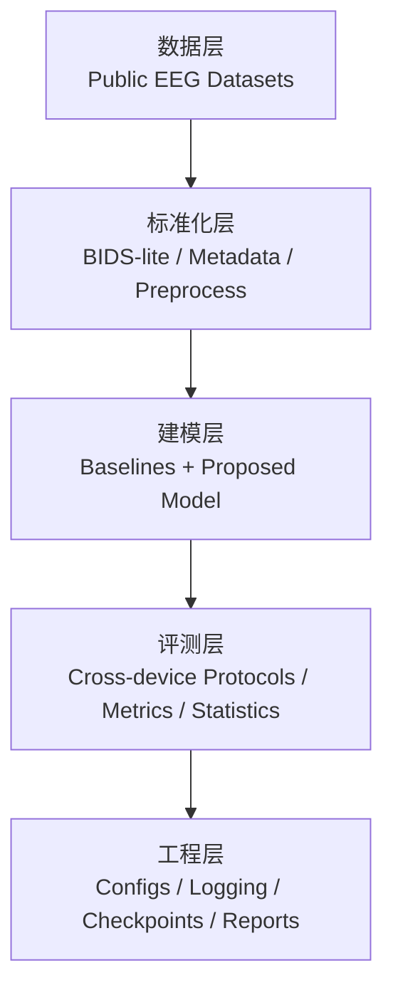
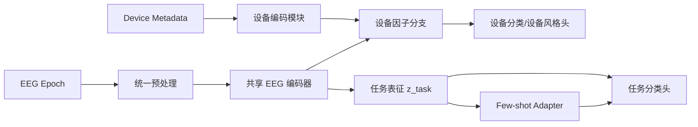

# 第一阶段整体实施方案规划（Phase I）

## 1. 项目定位与阶段边界

**项目主题**：面向跨设备少校准 EEG-BCI 的设备无关表征学习与标准化基准建设。  
**阶段范围**：从现在启动，到你自有开放接口 EEG 设备到手前后约 2–3 个月，以公开数据为主完成第一阶段闭环；自采数据在本阶段中仅作为可选增强项，不作为关键依赖。  
**主范式选择**：第一阶段聚焦**单模态 EEG + 运动想象（MI）**；SSVEP 作为次级验证支线，不作为主战场。  
**总体原则**：先做“能快速出成果、能复现、能发文章”的主线，再为后续真实设备、多模态、6G 融合预留接口。

### 1.1 第一阶段的核心判断

第一阶段不宜把工作重点放在“原始信号级大融合”或“从零训练 EEG 大模型”上，而应当聚焦于：

1. **跨设备 EEG 标准化基准构建**；
2. **设备效应可解释建模**；
3. **少样本新设备快速适配**；
4. **可复现代码与论文闭环**。

### 1.2 第一阶段的最终产出

第一阶段结束时，至少形成四类可交付成果：

- 一个可复现的 **Cross-Device MI Benchmark v1**；
- 一组覆盖传统方法、深度方法和域适应方法的强基线；
- 一个面向论文投稿的核心方法原型（显式设备因子建模 + 少校准适配）；
- 一个 GitHub 可开源的完整项目代码框架与实验记录体系。

---

## 2. 研究目标

## 2.1 科学目标

1. **回答跨设备 EEG-BMI 的核心问题**：模型性能下降到底主要来自哪里——通道布局差异、参考方式差异、频谱/噪声差异，还是设备身份本身带来的分布偏移？
2. **验证显式设备建模是否有效**：与“仅做通用域适应”相比，显式建模设备因子是否能更有效地提升跨设备泛化。
3. **验证新设备少样本适配的可行性**：在极少量目标设备样本下，是否能够快速恢复接近设备内训练的性能上界。

## 2.2 工程目标

1. 建立统一的数据组织与预处理流水线；
2. 在本地 RTX4060 笔记本上完成主要实验训练与复现；
3. 将所有实验流程模块化，后续可直接接入真实设备数据；
4. 保留边云协同接口，为后续 6G 部署留出模型导出、轻量推理和边缘协同空间。

## 2.3 论文目标

第一阶段的目标不是“做最大最全”，而是形成一篇结构清晰、贡献明确、可复现性强的论文。建议文章的主贡献围绕以下三点展开：

- **贡献 1：** 构建标准化的跨设备 MI 基准；
- **贡献 2：** 提出显式设备因子建模与少样本适配框架；
- **贡献 3：** 系统比较“无适配下界”和“少量校准上界”。

## 2.4 验收指标（建议）

| 目标类型 | 验收内容 | 建议验收标准 |
|---|---|---|
| 数据基础设施 | 完成 4 个主数据集统一接入 | 全部完成统一标签、统一预处理、统一元数据登记 |
| 基线建立 | 完成传统/深度/域适应基线 | 至少 6 组强基线可稳定复现 |
| 核心方法 | 完成显式设备建模方法 v1 | 能在主协议上相对最强基线取得稳定提升 |
| 少样本适配 | 完成 zero-shot 与 few-shot 协议 | 给出 0-shot 与不同校准量条件下的完整曲线 |
| 工程复现 | 本地完整跑通主实验 | 单次主实验可在本地稳定运行 |
| 论文准备 | 完成图表、结果表和方法说明 | 达到投稿初稿质量 |

---

## 3. 技术路线

## 3.1 总体技术路线

第一阶段采用“**数据基准先行，算法方法跟进，工程体系同步建设**”的路线，避免一开始就把精力耗在复杂模型上。

## 3.2 技术路线拆解

### 路线 A：数据基础设施与标准化基准建设

这是第一阶段的地基，优先级最高。

核心工作：

- 数据集接入与解析；
- 标签统一；
- 预处理统一；
- 通道布局统一；
- 元数据记录统一；
- 评测协议统一。

### 路线 B：强基线建立

在提出新方法前，必须先回答“问题难点到底在哪里”。因此需要建立三类基线：

- **传统统计/几何基线**：CSP、FBCSP、Riemannian；
- **轻量深度基线**：EEGNet、ShallowConvNet、小型 Transformer；
- **域适应基线**：EA、DANN、CORAL/对齐类方法。

### 路线 C：核心方法开发

在已有强基线上，开发第一阶段的核心方法：

- 以共享 EEG 编码器提取表征；
- 显式引入设备身份与设备元数据；
- 将任务相关表征与设备相关表征进行分离；
- 在目标设备端仅用极少量样本完成快速适配。

### 路线 D：论文与工程封装

第一阶段必须同步形成：

- 图表模板；
- 实验日志；
- 版本化配置；
- 结果复现实验脚本；
- 论文写作所需表格和关键可视化。

---

## 4. 第一阶段系统架构

## 4.1 研究系统的分层架构

第一阶段建议采用“五层系统架构”：

### 第 1 层：数据层

负责管理所有公开数据集及其原始格式，包括 EDF、MAT、GDF 等。该层只解决“拿到数据”的问题，不直接做算法假设。

### 第 2 层：标准化层

负责把所有异构数据统一成可训练的中间表示，包括：

- 统一采样率；
- 统一参考方式；
- 统一标签体系；
- 统一公共通道或统一虚拟通道网格；
- 统一元数据字典（设备型号、采样率、参考方式、硬件滤波、通道坐标等）。

### 第 3 层：建模层

包括两条并行子链路：

1. **Baseline 链路**：传统方法、深度方法、域适应方法；
2. **Proposed 链路**：显式设备因子建模 + 少样本适配。

### 第 4 层：评测层

统一管理评测协议、统计检验与误差分析，包括：

- leave-one-device-out；
- zero-shot / few-shot；
- 不同通道统一策略对比；
- 不同参考方式和归一化策略消融；
- 设备泛化差距分析。

### 第 5 层：工程层

负责项目工程化与可复现性，包括：

- 配置管理；
- 实验追踪；
- 结果缓存；
- 模型权重管理；
- 自动生成表格与图表；
- 面向 GitHub 的文档结构。

## 4.2 阶段一建议的算法系统抽象图

虽然第一阶段暂不展开完整理论推导，但系统架构上应从一开始就为后续方法预留接口。

这个架构的目的不是让模型“忽略设备”，而是**显式分离任务信息与设备信息**，从而实现更稳健的跨设备迁移。

---

## 5. 实验设计

## 5.1 数据集选择

### 主实验数据集（第一阶段主线）

建议采用以下四个 MI 数据集构成主 benchmark：

| 数据集 | 设备 | 通道数 | 采样率 | 角色 |
|---|---:|---:|---:|---|
| PhysioNet EEGMMIDB | BCI2000 系统 | 64 | 160 Hz | 跨设备主源域 |
| Lee2019_MI | BrainAmp | 62 | 1000 Hz | 跨设备主源域 |
| Cho2017 | BioSemi ActiveTwo | 64 | 512 Hz | 跨设备主源域 |
| Dreyer2023 | g.tec g.USBamp | 27 | 512 Hz | 跨设备主源域 |

### 备选/辅助数据集

- **BCI Competition IV-2a**：作为单设备开发调试集；
- **MAMEM1 / MAMEM3**：作为后续 SSVEP 次级验证支线；
- 若后续引入真实设备数据，则作为外部目标域进行补充验证。

## 5.2 任务定义与标签统一

第一阶段主任务统一为：

- **二分类 MI：左手想象 vs 右手想象**。

统一为二分类有三个好处：

1. 四个主数据集更容易达成标签一致；
2. 实验设计更干净，便于隔离设备效应；
3. 更有利于快速构建强基线和完成论文闭环。

后续若结果稳定，再扩展到四分类 MI 或引入脚/舌等类别。

## 5.3 预处理协议（建议作为 Benchmark 默认协议）

### 预处理默认配置

- 工频陷波：50 Hz；
- 带通滤波：4–38 Hz（主分析链路）；
- 传统 MI 基线可加滤波器组：8–12 Hz、12–30 Hz；
- 重采样：统一到 **160 Hz**；
- 重参考：默认 **CAR**，并保留 **REST** 作为消融项；
- Epoch 切片：以任务提示为锚点，主分析窗建议为 **cue 后 0.5–4.0 s**；
- 幅值标准化：**median / IQR 鲁棒归一化**；
- 坏段剔除：采用统一阈值规则；
- ICA：第一阶段不设为 benchmark 默认必选项，仅作为可选增强链路。

### 这样设计的原因

- 160 Hz 可以兼容最小采样率数据源；
- MI 的判别信息主要集中在 mu/beta 相关频段；
- 鲁棒归一化有助于减弱不同放大器增益、异常毛刺和伪迹引起的数值偏移；
- CAR 更实用、复现门槛更低；REST 适合做补充分析但不宜作为阶段一的唯一默认方案。

## 5.4 通道统一策略

第一阶段建议同时建立两个评测协议，避免结果依赖单一空间对齐策略。

### 协议 A：严格公共通道协议（Strict Common-Subset Protocol）

只保留所有数据集共有的核心运动区通道，例如：

- FC3、FCz、FC4
- C3、Cz、C4
- CP3、CPz、CP4

该协议优点：

- 实现简单；
- 可解释性强；
- 对公开数据缺失电极坐标的依赖最低；
- 更适合作为“保底 benchmark”。

### 协议 B：虚拟统一电极网格协议（Virtual Grid Protocol）

将不同设备通道通过球面样条插值映射到一个统一的 10-20/10-10 虚拟电极网格（如 21 通道）。

该协议优点：

- 保留更多空间信息；
- 更接近未来真实跨设备部署；
- 更适合验证显式设备建模是否仍然有效。

### 建议做法

- **协议 A 作为论文主结果的稳定基准**；
- **协议 B 作为增强协议和方法上限验证**。

## 5.5 评测协议

### P0：设备内基线（Within-Device Sanity Check）

目的：确认预处理与模型实现无误。  
做法：在每个数据集内部独立训练测试，给出合理性能范围。

### P1：跨被试设备内泛化

目的：建立设备内上界参考。  
做法：同一设备内做 LOSO（leave-one-subject-out）或固定训练/测试划分。

### P2：跨设备零样本泛化（Zero-shot Leave-One-Device-Out）

目的：这是第一阶段最核心的主协议。  
做法：每次留出 1 台设备作为目标域，其余 3 台设备作为训练域，目标设备不提供任何标注样本。

例如：

- Train: EEGMMIDB + Lee2019_MI + Cho2017 → Test: Dreyer2023
- 轮换 4 次，报告平均值与各设备明细

### P3：跨设备少样本适配（Few-shot Target Adaptation）

目的：验证“少量校准是否能快速恢复性能”。  
做法：在 P2 的基础上，逐步给目标设备加入极少量标注样本，例如：

- 5 trials / class
- 10 trials / class
- 20 trials / class
- 40 trials / class

输出：

- 适配曲线；
- 达到某性能阈值所需样本数；
- 与 fully fine-tuned 上界的差距。

### P4：通道统一策略鲁棒性测试

目的：分析模型是否严重依赖某种通道统一方案。  
做法：比较协议 A 与协议 B 的性能差异。

### P5：设备元数据与设备分支消融

目的：验证显式设备建模是否真的提供收益。  
做法：比较以下模型：

- 无设备信息；
- 仅设备 ID 嵌入；
- 设备对抗分支；
- 设备因子显式分离；
- 设备因子 + few-shot adapter。

## 5.6 基线方法设计

### 传统基线

1. CSP + LDA；
2. FBCSP + SVM / LDA；
3. Riemannian MDM；
4. Tangent Space + Logistic Regression。

### 深度学习基线

1. EEGNet；
2. ShallowConvNet；
3. 小型 Transformer / Conformer 风格编码器（轻量版即可）。

### 域适应/对齐基线

1. Euclidean Alignment（EA）+ 传统分类器；
2. EA + EEGNet；
3. DANN；
4. CORAL / DSBN / 轻量特征对齐模块（择其一作为补充）。

### 第一阶段建议的“最强基线组合”

建议至少确保以下四个 baseline 跑扎实：

- FBCSP + LDA
- Riemannian Tangent Space + LR
- EEGNet
- EA + EEGNet / DANN

这样即使新方法提升不大，论文也仍然有扎实的 benchmark 价值。

## 5.7 指标体系

### 主指标

- **Balanced Accuracy**（主指标）
- **Macro-F1**
- **Cohen’s Kappa**

### 辅助指标

- 设备泛化差距：
  - `Gap = within-device performance - cross-device performance`
- 少样本适配效率：
  - 达到目标性能所需的样本数
- 训练成本：
  - 参数量
  - 单次训练时长
  - 显存占用
- 推理成本：
  - 单 trial 推理时延

### 统计分析

- 对各设备结果做配对统计检验；
- 报告均值、标准差、置信区间；
- 必要时报告效应量；
- 做设备级和被试级误差分析。

## 5.8 可视化结果设计

第一阶段建议从一开始就约定论文可直接使用的图表模板：

1. 各设备 zero-shot 结果柱状图；
2. few-shot 适配曲线；
3. 通道统一协议 A/B 对比图；
4. t-SNE/UMAP 表征可视化（按设备和按类别分别着色）；
5. 设备混淆矩阵与任务混淆矩阵；
6. 设备泛化差距雷达图或箱线图。

---

## 6. 第一阶段里程碑计划（建议按 12 周执行）

## 第 1–2 周：数据审计与工程初始化

目标：把项目地基搭起来。

- 确定主数据集下载方式与许可；
- 建立 GitHub 仓库和目录结构；
- 统一实验命名规范；
- 设计 BIDS-lite 元数据字典；
- 完成 1 个数据集的打通验证。

**阶段输出**：项目仓库骨架 + 数据清单 + 数据接入原型。

## 第 3–4 周：预处理流水线与基准构建

目标：完成 benchmark v0。

- 接入全部主数据集；
- 跑通统一预处理；
- 完成公共通道协议 A；
- 完成标签统一和样本抽样规则；
- 生成 benchmark 统计报告。

**阶段输出**：Cross-Device MI Benchmark v0。

## 第 5–6 周：基线系统建立

目标：完成一组可信强基线。

- 完成 CSP / FBCSP / Riemann 基线；
- 完成 EEGNet / ShallowConvNet；
- 完成 zero-shot 与 within-device 主协议测试；
- 做第一次结果复盘。

**阶段输出**：Baseline Report v1。

## 第 7–9 周：核心方法开发

目标：形成论文核心方法 v1。

- 加入设备元数据输入；
- 实现任务分支 + 设备分支；
- 实现少样本目标设备适配模块；
- 跑通 P2 / P3 主协议。

**阶段输出**：Proposed Method v1 + 初步对比结果。

## 第 10–11 周：消融、统计与图表整理

目标：把实验做扎实。

- 做协议 A / B 对比；
- 做有无设备分支消融；
- 做 few-shot 不同样本数曲线；
- 做结果可视化和统计检验；
- 梳理失败案例。

**阶段输出**：Ablation Report + 论文图表包。

## 第 12 周：论文封装与开源整理

目标：形成投稿级材料。

- 写方法部分；
- 写实验部分；
- 固化结果表格和配置；
- 补全 README、环境依赖、复现脚本；
- 准备内部汇报版材料。

**阶段输出**：论文初稿 + 开源版本说明。

---

## 7. 与真实设备到手后的衔接设计

第一阶段虽然不依赖自有设备，但必须从设计上确保未来可无缝衔接。

## 7.1 数据接口预留

代码层面应从一开始就将“公开数据”和“本地真实设备数据”视为同一抽象接口：

- `raw -> event -> epoch -> tensor -> metadata`

这样等设备到手后，只需要新增一个设备适配器，而不需要重写整个训练与评测流程。

## 7.2 协议对齐

未来自采数据建议优先复用第一阶段协议：

- 左/右手 MI；
- 相同 cue 时长；
- 相同 epoch 定义；
- 相同公共通道映射；
- 相同预处理配置。

这样可以把真实设备数据直接当作新的目标设备域，接入现有 benchmark。

## 7.3 与 6G 的衔接接口

第一阶段不把 6G 作为硬约束，但系统设计上应预留：

- 轻量模型导出接口；
- 设备端实时推理接口；
- 边缘端 few-shot 更新或模型校准接口；
- 模型中间表征/原型向量上传接口。

后续如果进入 6G 场景，阶段一的成果可以直接扩展为“本地推理 + 边缘适配”的框架。

---

## 8. 风险点与备选方案

## 风险 1：公开数据标签不完全一致

**应对策略**：第一阶段统一收缩到“左/右手二分类 MI”。先把问题做干净，再扩展。

## 风险 2：通道布局差异过大，插值不稳定

**应对策略**：双协议并行。严格公共通道协议作为保底；虚拟统一网格协议作为增强。

## 风险 3：设备间性能提升不显著

**应对策略**：将贡献重心放在“标准化 benchmark + 显式设备效应分析 + few-shot 适配曲线”，而不是单纯追求某个单点 SOTA。

## 风险 4：本地算力受限

**应对策略**：

- 第一阶段优先使用轻量模型；
- 大模型仅作为可选 frozen encoder 或对照；
- 全部实验以 4060 可完成为原则设计。

## 风险 5：设备提前/延迟到货

**应对策略**：

- 提前到货：增加一个“小规模真实设备外部验证”；
- 延迟到货：不影响第一阶段主线结果与论文完成。

---

## 9. 第一阶段的建议成果命名

为了便于后续代码与论文统一，建议第一阶段成果使用统一命名体系。

### 项目代号（可选）

- **CD-MI-Bench**：Cross-Device Motor Imagery Benchmark
- **DeFEEG**：Device-Factorized EEG
- **X-Device-EEG-MI**：面向跨设备 MI 的统一工程项目名

### 论文暂定标题（可选）

- **Towards Cross-Device EEG Motor Imagery Decoding with Explicit Device-Factor Modeling and Few-Shot Adaptation**
- **A Standardized Benchmark and Device-Aware Adaptation Framework for Cross-Device EEG-BCI**

---

## 10. 第一阶段的最终建议

如果把第一阶段压缩成一句话，它的核心任务就是：

> **先用公开 MI 数据做出一个标准化、可复现、可发表的跨设备 benchmark 与少校准适配框架，再把真实设备接入作为第二阶段的高价值增强，而不是第一阶段的必要前提。**

因此，第一阶段最合理的工作排序是：

1. 先把数据和评测协议统一；
2. 再把强基线做扎实；
3. 然后在“显式设备建模 + 少样本适配”上做方法创新；
4. 最后把工程、图表和论文封装好。

这条路线最符合你当前的资源条件、发文目标和后续向真实设备与 6G 延展的需求。
