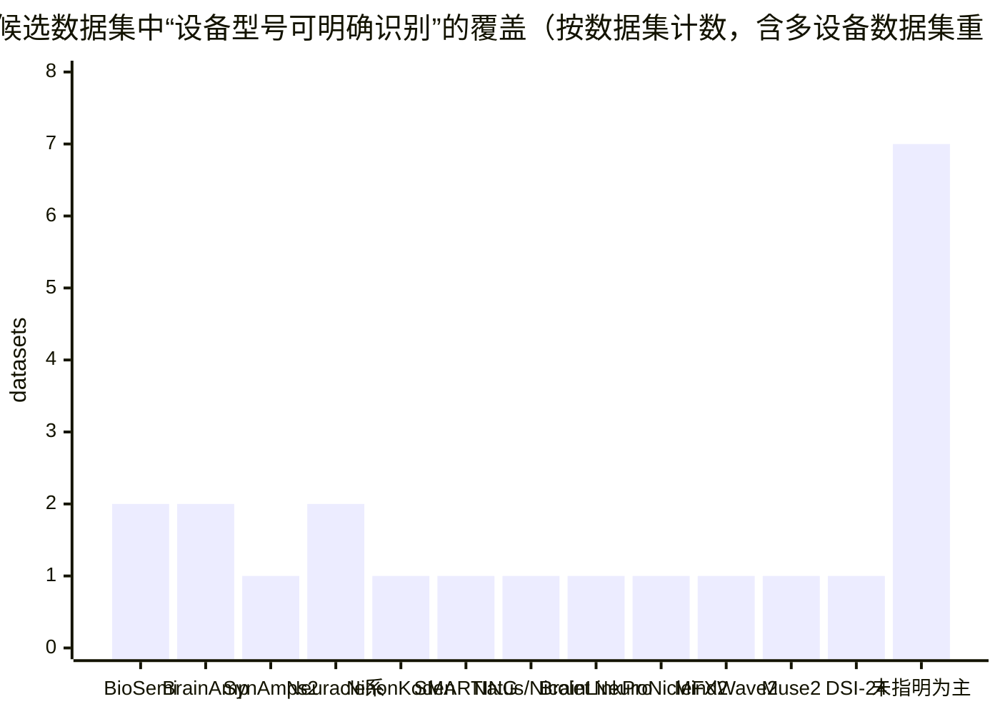
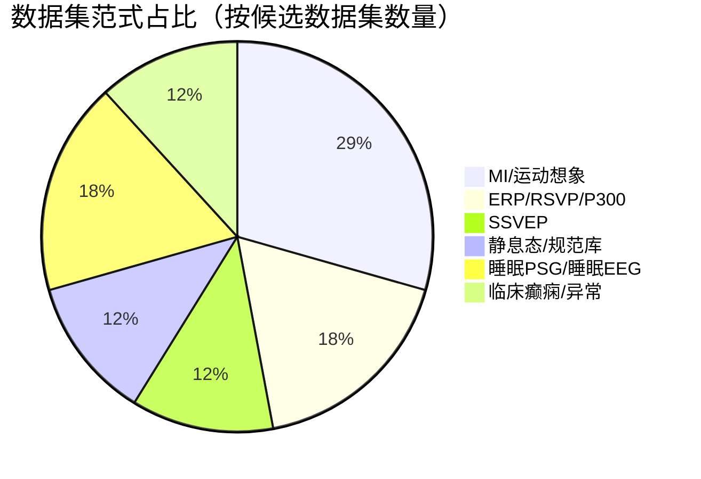
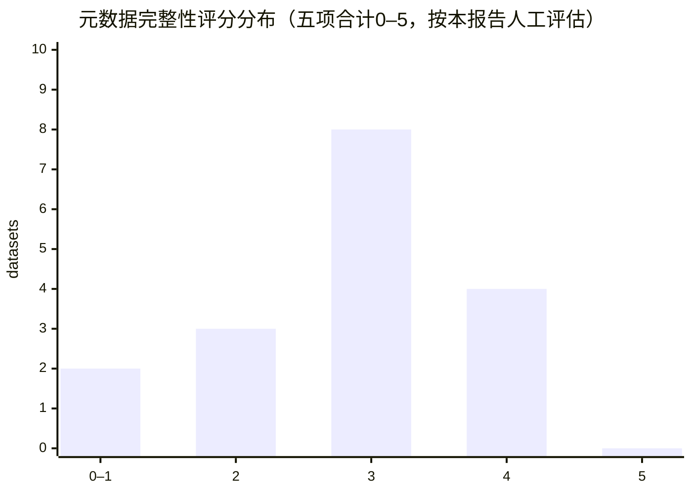

# 可用于跨EEG设备型号数据融合研究的开源EEG数据集调研报告

## 执行摘要

跨EEG设备型号数据融合（cross-device fusion / harmonization）研究对数据集的核心诉求是：**设备信息可追溯（至少到“设备型号+通道布局+采样率+参考方案/是否无硬参照”）**，并尽可能满足**同一范式下的多设备采集**（同被试“同时”或“顺序”佩戴多设备，在一致任务与环境下采集），这样才能把“被试差异/状态差异”与“设备域差异”相对解耦，从而支撑严谨的域适配、校准、归一化与可比基准评测。[1][2] citeturn20view0turn21view1turn26view0

在可公开获取的数据中，最直接支持“跨设备融合”方法学验证的两类资源是：  
第一类是**同被试多设备**数据集：例如“消费级与研究级设备对比数据集”（同被试顺序佩戴5种设备）与“scalp+ear 双系统同时采集移动BCI数据集”。[1][2] citeturn20view0turn21view1turn26view0  
第二类是**设备型号明确且元数据较全**、可作为“源域/目标域”组合的单设备大样本数据集（如OpenBMI、BETA、RSVP/P300、OpenNeuro BIDS静息态等），适合构建跨设备评测基准或进行“跨库迁移”。[3][5][6][9] citeturn27view0turn8search5turn16view0turn0search10turn4search3

本报告共整理**17个**候选开源数据集/语料库（含需注册/签署协议者），覆盖主要仓库与平台（如PhysioNet、OpenNeuro、OSF、Figshare、GigaDB、NEDC/TUH、CONP等）。其中，**多设备（同被试同时/顺序）且开放可获取**的数据集数量并不多，建议优先用它们建立“设备域差异”方法学，而将大规模单设备数据集用于扩展泛化与稳健性验证。[1][2][3][5] citeturn20view0turn21view1turn26view0turn27view0turn8search5

## 研究范围与筛选方法

本报告聚焦“**可用于跨EEG设备型号数据融合研究**”的数据集，筛选标准如下：  
数据层面需提供可用于重建统一数据结构的原始或近原始EEG（EDF/EDF+、BDF、BrainVision、GDF、MAT等），且最好包含事件标注（任务范式/试次切分）或明确的静息态条件。[1][2][6][13] citeturn21view1turn26view0turn16view0turn13search0  
元数据层面优先选择：明确记录**设备型号**、采样率、通道数与通道命名/布局（10–20/10–10等）、参考/接地方案、硬件滤波（若有）、电极坐标（若有）。对“未指明”的条目在表中明确标注，并给出进一步确认路径（README、数据头信息、补充材料或联系作者）。[2][12][15] citeturn26view0turn14view0turn13search11  
开放性层面：优先完全开放下载；若需注册/协议（例如entity["organization","CONP","canadian open neuroscience platform"]或entity["organization","NEDC","tuh eeg distributor"]）则注明门槛，因为这会影响复现与社区基准化速度。[11][16] citeturn12view0turn10view0

## 数据集目录与关键元数据对比表

下表按“跨设备融合价值”优先级（高/中/低）综合排序：优先级高通常意味着**同被试多设备**或**设备明确+元数据较全+易标准化（最好BIDS或可BIDS化）**。表内“元数据完整性”按五项打勾并给出0–5评分：  
设备型号（Device）/ 固件或采集软件版本（FW/SW）/ 硬件滤波信息（HW Filter）/ 参考方案（Ref）/ 电极坐标（Coords）。

> 说明：为满足“访问链接”要求，优先给出DOI；若以仓库ID为主（如OpenNeuro dsXXXXXX、PhysioNet项目名），也在“访问”中给出可检索标识。

| 数据集（访问） | 主要用途/范式 & 样本量 | 多设备/设备型号记录 | 设备型号列表（文档有则列出） | 通道数与采样率 | 文件格式 | BIDS或BIDS可转换性 | 元数据完整性（✓/×，评分/5） | 适合跨设备融合的理由 & 主要局限 | 优先级 |
|---|---|---|---|---|---|---|---|---|---|
| 消费级与研究级EEG对比数据集（Figshare DOI: 10.6084/m9.figshare.30162868）[1] citeturn20view0turn21view1 | 设备评估/静息+运动伪迹（眨眼、咬牙、头动睁眼/闭眼），30被试；每设备4范式，每范式前后静息[1] citeturn20view0turn21view1 | **同被试多设备：顺序佩戴**；设备型号明确[1] citeturn20view0turn21view1 | BrainLink Pro、NeuroNicle FX2、MindWave Mobile 2、Muse 2、DSI-24；并给出部分电极位置/参考描述[1] citeturn21view1 | 1ch@512Hz；2ch@250Hz；1ch@512Hz；4ch@256Hz；21ch@300Hz（见文中设备表）[1] citeturn21view1 | EDF + MAT（事件码在两者均提供）[1] citeturn21view1 | 未指明BIDS；可BIDS化（需补channels/electrodes/events等表） | Device✓ FW/SW✓ HW Filter× Ref✓ Coords× → **3/5** | 直接把“设备域差异”置于同一被试/同协议下，最适合作为跨设备归一化与校准的“金标准”基准；局限是多为低通道/不一致通道布局，融合多通道空间方法受限[1] citeturn20view0turn21view1 | 高 |
| 移动BCI：scalp与ear EEG同时采集（OSF DOI: 10.17605/OSF.IO/R7S9B；元数据DOI: 10.6084/m9.figshare.16669072）[2] citeturn26view0turn25search16 | ERP(300 trials) + SSVEP(60 trials)；24被试（SSVEP为23）；含不同速度步行/跑步[2] citeturn26view0 | **同被试多设备：同时采集**（scalp+ear+IMU）且设备型号明确[2] citeturn26view0 | scalp：entity["company","Brain Products","eeg manufacturer"] BrainAmp；ear：entity["company","mBrainTrain","smarting amplifier"] SMARTING + cEEGrid；IMU：APDM[2] citeturn26view0 | scalp 32ch@500Hz；ear 14ch@500Hz；IMU 128Hz[2] citeturn26view0 | BrainVision Core Data Format[2] citeturn26view0 | 非BIDS；可BIDS化（BrainVision→BIDS生态成熟） | Device✓ FW/SW(部分)✓ HW Filter× Ref✓ Coords× → **3/5** | “同时采集”非常适合研究跨系统融合、参考统一、时序对齐与噪声鲁棒；局限是耳周电极与头皮布局差异大，属于“跨设备+跨布置”双重域偏移，融合难度也更大[2] citeturn26view0 | 高 |
| OpenBMI三范式数据集（GigaDB: 100542）[3][4] citeturn27view0turn8search37 | MI + ERP(P300拼写) + SSVEP；**54被试**；两天两次会话[3] citeturn27view0 | 单设备；设备型号明确[3] citeturn27view0 | entity["company","Brain Products","eeg manufacturer"] BrainAmp；62 Ag/AgCl；鼻根参考（nasion-ref），AFz接地[3] citeturn27view0 | 62 EEG @1000Hz（另含EMG）[3] citeturn27view0 | 未在本文节选中逐项列明；以GigaDB文件说明为准（通常含MAT与工具脚本）[4] citeturn8search37turn27view0 | 非BIDS（原始发布）；可BIDS化（范式/事件清楚） | Device✓ FW/SW× HW Filter(部分)✓ Ref✓ Coords× → **3/5** | 作为“研究级单设备大样本”源域非常强，可与其他SSVEP/ERP/MI数据集构成跨设备迁移基准；局限是缺少逐被试电极坐标与更细的硬件链路信息，且跨设备需另选目标域数据[3][4] citeturn27view0turn8search37 | 中-高 |
| BETA SSVEP基准库（论文：10.3389/fnins.2020.00627；见BETA描述）[5] citeturn8search5turn8search25 | SSVEP大规模基准；64ch；硬件滤波与采样信息明确[5] citeturn8search5 | 单设备；设备型号明确[5] citeturn8search5 | entity["company","Neuroscan","eeg system brand"] SynAmps2（Neuroscan）[5] citeturn8search5 | 64ch@1000Hz；硬件通带0.15–200Hz；50Hz陷波[5] citeturn8search5turn8search25 | 未在节选中列出具体封装（需查发布页/附录）；常见为MAT分发 | 非BIDS；可BIDS化（事件结构较规则） | Device✓ FW/SW× HW Filter✓ Ref(部分)✓ Coords× → **4/5** | 适合作为SSVEP跨设备融合“目标域/对照域”；局限是需要与其他SSVEP数据集配对才体现跨设备价值，且若文件格式/事件表未统一需先工程化[5] citeturn8search5turn8search25 | 中-高 |
| RSVP + P300拼写 + 静息（Figshare DOI: 10.6084/m9.figshare.c.5769449.v1）[6] citeturn16view0 | 静息（睁/闭眼）+ RSVP + P300 Speller；RSVP N=50；P300 N=55；含问卷与电极三维坐标[6] citeturn16view0 | 单设备；设备型号明确[6] citeturn16view0 | entity["company","BioSemi","eeg manufacturer"] ActiveTwo；32 Ag/AgCl active electrodes[6] citeturn16view0 | 32ch@512Hz；10–20布局；提供每被试电极3D坐标（Polhemus Fastrack）[6] citeturn16view0 | 论文未在节选中直接声明格式；数据发布见Figshare条目[6] citeturn16view0 | 未指明BIDS；**可BIDS化潜力高**（坐标+事件+静息齐全） | Device✓ FW/SW× HW Filter× Ref✓ Coords✓ → **4/5** | 优秀的ERP/注意范式“目标域”候选，可与BrainAmp / SynAmps2等ERP数据做跨设备对齐；局限是格式需核实与工程化，且为单设备[6] citeturn16view0 | 中-高 |
| MIND多日MI数据集（Figshare DOI: 10.25452/figshare.plus.22671172）[7] citeturn15view0 | MI（2类与3类），**62被试×3天会话**；原始+预处理双版本[7] citeturn15view0 | 单设备；设备型号明确[7] citeturn15view0 | entity["company","Neuracle","eeg manufacturer"] 无线EEG设备（文中注明为Neuracle自研设备）[7] citeturn15view0 | 64ch cap；采样1000Hz；原始含ECG/EOG通道位[7] citeturn15view0 | 原始：BDF（data.bdf/evt.bdf）；预处理：MAT；并按EEG-BIDS组织[7] citeturn15view0 | **EEG-BIDS**（原始组织）[7] citeturn15view0 | Device✓ FW/SW(部分)✓ HW Filter× Ref✓ Coords× → **3–4/5** | 适合作为“国产设备域”大样本源域/目标域，BIDS结构便于融合研究复现；局限是跨设备需另选对照数据集，且电极坐标是否逐被试提供需查BIDS字段[7] citeturn15view0 | 中 |
| 下肢MI数据集（Scientific Data 2025，10.1038/s41597-025-04618-4）[8] citeturn8search36 | 下肢MI；更偏康复/步态意图；样本量见原文数据发布页[8] citeturn8search36 | 单设备；设备型号明确[8] citeturn8search36 | entity["company","Neuracle","eeg manufacturer"] NeuSenW放大器 + 64ch Ag/AgCl cap[8] citeturn8search36 | 64ch@1000Hz；50Hz陷波；10–20布局[8] citeturn8search36 | 未指明（需查论文数据记录/仓库README） | 未指明；可BIDS化 | Device✓ FW/SW× HW Filter(部分)✓ Ref× Coords× → **2–3/5** | 可与同公司不同型号/不同实验室MI数据构成跨设备迁移；局限是公开页面节选未给出完整文件格式与参考/坐标细节，需进一步确认[8] citeturn8search36 | 中 |
| SRM静息态EEG（OpenNeuro: ds003775；DOI: 10.18112/openneuro.ds003775.v1.2.1）[9][10] citeturn0search10turn4search3 | 静息态（睁眼/闭眼、被动之类依原文）；111健康被试；用于静息态网络等[9] citeturn0search10 | 单设备；设备型号明确[9] citeturn0search10 | entity["company","BioSemi","eeg manufacturer"] ActiveTwo[9] citeturn0search10 | 64ch@1024Hz；EDF（OpenNeuro条目）[9][10] citeturn0search10turn4search3 | EDF（BIDS内） | **BIDS（OpenNeuro）**[10] citeturn4search3 | Device✓ FW/SW× HW Filter× Ref(部分)✓ Coords(可能)✓? → **3–4/5** | BIDS生态强，极适合做“BIDS化融合流水线”样板；局限是单设备，跨设备需要选取另一静息态数据集对照（并统一参考/采样/通道子集）[9][10] citeturn0search10turn4search3 | 中 |
| CHBMP规范库（CONP项目CHBMP；EEG-BIDS）[11] citeturn12view0 | 静息态高密度qEEG（含睁/闭眼、过度换气等）；**282被试**[11] citeturn12view0 | 设备型号未明确；但**EEG-BIDS**格式与多条件长时记录[11] citeturn12view0 | **未指明**（可通过BIDS metadata或源码仓库进一步查）[11] citeturn12view0 | 64–120 ch；≥30分钟；采样率未在节选中给出[11] citeturn12view0 | EEG-BIDS（并含MRI/认知数据）[11] citeturn12view0 | **BIDS**[11] citeturn12view0 | Device× FW/SW× HW Filter× Ref× Coords?（取决于BIDS字段） → **1–2/5** | 大样本静息态+EEG-BIDS非常适合做跨库融合与规范化统计，但若设备链路不清晰会限制“硬件域差异”可解释性；需进一步从BIDS侧文件核查设备字段、参考与电极坐标[11] citeturn12view0 | 中 |
| ANPHY-Sleep高密度睡眠EEG（OSF DOI: 10.17605/OSF.IO/R26FH）[12] citeturn14view0 | 睡眠PSG + 83通道HD-EEG；**29健康被试**；含睡眠分期与平均电极坐标[12] citeturn14view0 | 单设备；设备型号明确[12] citeturn14view0 | entity["company","Nihon Kohden","medical device maker"] Nihon Koden JE-120 256-ch amplifier（文中）[12] citeturn14view0 | EEG 83ch@1000Hz（另含EOG/EMG/ECG）；并提供电极共配准平均坐标[12] citeturn14view0 | EDF + 注释txt + 质量矩阵等[12] citeturn14view0 | 非BIDS；可BIDS化（通道、事件、睡眠分期可映射） | Device✓ FW/SW× HW Filter× Ref✓ Coords✓ → **4/5** | 适合睡眠领域的跨设备/跨实验室融合（高密度+坐标有利于空间对齐）；局限是睡眠范式与一般BCI范式不同，跨设备研究需选取另一睡眠EEG库作为目标域[12] citeturn14view0 | 中 |
| Sleep-EDF Expanded（PhysioNet: sleep-edfx）[13] citeturn13search0 | PSG睡眠分期；常用基准库；EEG导联Fpz-Cz、Pz-Oz（等）[13] citeturn13search0 | 设备型号未指明（需看EDF头/原始论文） | **未指明** | EEG双导联（或少量导联），“采样率/通道细节以EDF/项目页为准”[13] citeturn13search0 | EDF | 非BIDS；可BIDS化（已有社区转换实践） | Device× FW/SW× HW Filter× Ref(部分)✓ Coords× → **1–2/5** | 适合做“低通道睡眠EEG跨库迁移”与基准对照；局限在于设备链路不清晰、导联少且与多通道融合任务的空间模型不匹配[13] citeturn13search0 | 中-低 |
| MASS（Montreal Archive of Sleep Studies）[14] citeturn13search5turn13search21 | PSG睡眠库；面向睡眠自动分期等；采样256Hz（论文描述）[14] citeturn13search21 | 设备型号通常未在门户页直接给出 | **未指明**（建议查论文/数据包README） | 4–20 EEG通道（论文/库描述）；F_s=256Hz[14] citeturn13search21 | 未在门户页节选中给出（多为PSG标准格式） | 未指明；可BIDS化 | Device× FW/SW× HW Filter× Ref× Coords× → **0–1/5** | 可与Sleep-EDF组合构建“睡眠跨库（隐含跨设备）迁移”；局限是元数据公开粒度偏粗，若缺少设备/参考/滤波细节，会降低融合研究的可解释性[14] citeturn13search5turn13search21 | 低 |
| PhysioNet EEG Motor Movement/Imagery（PhysioNet: eegmmidb）[23] citeturn19search21 | MI/运动任务（含多段记录）；109志愿者（PhysioNet条目常用）[23] citeturn19search21 | 设备型号未在MOABB节选中给出（需查PhysioNet原始说明） | **未指明** | 64ch@160Hz；参考mastoid（MOABB元数据）[23] citeturn19search21 | EDF/EDF+（PhysioNet常用分发） | 非BIDS；可BIDS化（EDF+事件可映射） | Device× FW/SW× HW Filter× Ref✓ Coords× → **1–2/5** | 作为经典MI目标域/对照域很有价值，便于与BrainAmp/BioSemi/Neuracle等MI数据做跨设备迁移；局限在于设备链路细节不足、采样率较低，需谨慎做频段/滤波一致化[23] citeturn19search21 | 中-低 |
| BCI Competition IV 2a（Graz dataset A）[20][22] citeturn7view0turn6view0 | 4类MI；9被试×2天×2会话；288 trials/会话[20] citeturn7view0 | 设备型号未指明（仅“amplifier”参数）；但参考/滤波/电极材质明确[20] citeturn7view0 | **未指明**；Ag/AgCl电极；左乳突参考、右乳突地[20] citeturn7view0 | 22 EEG +3 EOG；250Hz；0.5–100Hz带通；50Hz陷波[20] citeturn7view0 | GDF | 非BIDS；可BIDS化（事件码清晰） | Device× FW/SW× HW Filter✓ Ref✓ Coords× → **2/5** | 经典跨库基准，便于与现代MI数据集做跨设备/跨库迁移；局限是设备型号缺失与通道数有限，且GDF生态需转换[20][22] citeturn7view0turn6view0 | 中-低 |
| BCI Competition IV 2b（Graz dataset B）[21][22] citeturn7view1turn6view0 | 2类MI；9被试×5会话；含反馈会话[21] citeturn7view1 | 设备型号未指明；但滤波与通道构型描述较清楚[21] citeturn7view1 | **未指明**；3 bipolar（C3/Cz/C4相关）；Fz接地；EOG为乳突参考[21] citeturn7view1 | 3 EEG +3 EOG；250Hz；0.5–100Hz；50Hz陷波[21] citeturn7view1 | GDF | 非BIDS；可BIDS化 | Device× FW/SW× HW Filter✓ Ref✓ Coords× → **2/5** | 适合做“极低通道跨设备/跨算法”鲁棒性研究；局限是空间信息极少，跨设备融合多转化为时间/频域归一化问题[21][22] citeturn7view1turn6view0 | 低 |
| TUH EEG Corpus（TUEG/TUAB/TUSZ等，NEDC分发）[16][17][18] citeturn10view0turn11view0turn13search11 | 临床EEG大语料；TUEG 26,846记录；含异常、癫痫发作、事件等子库[16] citeturn10view0 | 多设备/多年代临床系统；**使用Natus Nicolet记录技术并导出EDF**（描述中有）[18] citeturn13search11 | entity["company","Natus Medical","nicolet eeg systems"] Nicolet（多代）；导出工具NicVue（版本在描述中给出）[18] citeturn13search11 | 典型24–36通道；250Hz；16bit（overview描述）[17] citeturn11view0 | EDF+（分发格式明确）[16][17] citeturn10view0turn11view0 | 非BIDS；可BIDS化但工程量大（通道/注释/病历文本多源） | Device✓ FW/SW(部分)✓ HW Filter× Ref(部分)✓ Coords× → **3/5** | 临床场景的跨设备/跨医院泛化研究“天然存在”，适合做大规模域自适应与稳健性；局限是获取门槛（需签协议/ssh+rsync），且设备/采样/通道异构极强，需要严格子集定义与元数据治理[16][17][18] citeturn10view0turn11view0turn13search11 | 中 |
| CHB-MIT Scalp EEG（PhysioNet归档页）[19] citeturn9search3 | 癫痫发作检测/预测常用；22儿童病例；长程记录[19] citeturn9search3 | 设备型号未指明 | **未指明** | 多数23通道；256Hz；16-bit；10–20系统[19] citeturn9search3 | EDF | 非BIDS；可BIDS化（但注释/发作标注需另整合） | Device× FW/SW× HW Filter× Ref× Coords× → **0–1/5** | 与TUH癫痫库可形成跨设备/跨机构迁移对照；局限是设备与参考/滤波细节不清晰，且临床标注体系差异大，融合研究需投入较多清洗/统一标注工作[19] citeturn9search3 | 低 |

### 对“设备型号未指明”数据集的进一步确认路径

对于表中标注“未指明”的数据集，建议按优先级做以下核查（从低成本到高成本）：  
首先查看数据包README与仓库“data description”页；其次读取EDF/BrainVision/GDF头信息（通常可见采样率、通道名、部分参考信息，少数会包含设备/导出软件字段）；再次查原始论文的Methods/补充材料；最后联系作者或维护方获取“采集链路清单”（放大器型号、固件、硬件滤波、参考方案、电极型号）。TUH语料已在描述中明确“由Natus Nicolet系统导出EDF，并给出NicVue版本示例”，是“临床多设备但可追溯”路线的代表。[18] citeturn13search11

## 设备覆盖、范式分布与元数据完整性分析

### 设备型号覆盖分布

从“设备明确”的数据集中，研究级系统主要集中在entity["company","BioSemi","eeg manufacturer"]、entity["company","Brain Products","eeg manufacturer"]与entity["company","Neuroscan","eeg system brand"]三类；国内设备方面以entity["company","Neuracle","eeg manufacturer"]为代表（含不同型号/系统形态）。消费级设备覆盖集中在Muse、NeuroSky系与单通道头环等。[1][2][3][5][6][7][12] citeturn21view1turn26view0turn27view0turn8search5turn16view0turn15view0turn14view0

> 注：Mobile BCI与“消费级/研究级对比”均为多设备数据集，因此在统计中按设备重复计入。[1][2] citeturn21view1turn26view0

### 数据集范式类型占比

目前公开数据中，“直接多设备同协议”的范式偏向**设备评估/伪迹鲁棒**与**ERP/SSVEP**（尤其是移动BCI与消费/研究级对比）。MI、静息态与睡眠数据多为单设备发布，但可通过跨库组合形成跨设备研究基准。[1][2][3][7][12][13] citeturn20view0turn26view0turn27view0turn15view0turn14view0turn13search0

### 元数据完整性评分分布

整体来看，**BIDS或接近BIDS生态**的数据集（如OpenNeuro条目、明确宣称EEG-BIDS组织的发布）更有利于跨设备融合研究中的“可复现对齐”（通道名、事件、采样率、受试者/会话结构）。[7][9][10][11] citeturn15view0turn0search10turn4search3turn12view0  
而传统经典基准（BCI Competition、Sleep-EDF、部分PhysioNet临床/睡眠库）往往在设备/硬件链路字段上缺失，需要研究者在融合前补充“最小元数据”。[13][19][20][21] citeturn13search0turn9search3turn7view0turn7view1

> 解释：该评分用于“跨设备融合研究的工程可落地性”粗评估：越高意味着越少需要补采/补写元数据与格式转换；并不代表数据质量本身优劣。[6][12][17] citeturn16view0turn14view0turn11view0

## 跨设备融合研究的选型建议与优先使用数据集

### 选型逻辑与实验设计启示

跨设备融合研究通常需要同时回答两个问题：  
一是“**同范式跨设备**”是否可通过统一参考、重采样、通道子集映射、幅度/谱归一化等方式显著缩小域差距；二是“**跨布置/跨形态（耳周 vs 头皮、单通道 vs 多通道）**”在多大程度上可融合，哪些表示学习/域适配方法能保留可解释的神经成分而不被伪迹主导。[1][2] citeturn21view1turn26view0

因此，建议将数据集分成两组来组织实验：  
第一组用于“强因果对照”（同被试多设备）：优先用[1][2]，因为它们分别提供“顺序佩戴多设备”和“同时采集双系统”，能更直接量化设备域差异并验证融合方法是否真正缩小差距。[1][2] citeturn20view0turn26view0  
第二组用于“规模化外推”（单设备大样本互作）：以[3][5][6][7][9][12]等为核心，构建多个“源域→目标域”方向（例如 BrainAmp→BioSemi、SynAmps2→Neuracle、NihonKoden→Sleep-EDF 等），检验方法的跨库泛化与稳健性，并记录元数据缺失带来的不确定性。[3][5][6][7][9][12][13] citeturn27view0turn8search5turn16view0turn15view0turn0search10turn14view0turn13search0

### 推荐优先使用的前三个数据集

首选推荐兼顾“跨设备直接性”“获取便利”“范式可复现”三条主线：

**第一推荐：消费级与研究级EEG对比数据集（Figshare）**  
它在同一套任务与环境下，让每个被试顺序佩戴5种不同设备，并明确列出各设备采样率、通道数、采集软件以及EDF与MAT事件编码方式，非常适合用来建立“跨设备对齐/归一化/校准”的可重复基准，并将设备差异从被试差异中最大限度剥离。[1] citeturn20view0turn21view1

**第二推荐：移动BCI scalp+ear 同时采集数据集（OSF）**  
它提供BrainAmp头皮EEG与SMARTING耳周EEG的同时采集，并在移动速度变化下同时包含ERP与SSVEP范式，是研究“多设备+多噪声情境”融合方法（对齐、抗伪迹、跨布置迁移）的稀缺公开资源。[2] citeturn26view0turn25search16

**第三推荐：OpenBMI三范式大样本（GigaDB）**  
虽然不是多设备，但它设备型号明确（BrainAmp）且覆盖MI/ERP/SSVEP并具备54被试两天会话，特别适合作为“研究级源域”与其他系统（BioSemi、SynAmps2、Neuracle等）构建跨设备迁移实验矩阵，推进从“小规模验证”到“大规模泛化”的过渡。[3][4] citeturn27view0turn8search37

## 参考文献

[1] *EEG dataset of consumer- and research-grade systems*. Scientific Data (2026). DOI: 10.1038/s41597-026-06962-5；数据集DOI: 10.6084/m9.figshare.30162868。citeturn20view0turn21view1  

[2] *Mobile BCI dataset of scalp- and ear-EEGs with ERP and SSVEP paradigms while standing, walking, and running*. Scientific Data (2021). DOI: 10.1038/s41597-021-01094-4；OSF DOI: 10.17605/OSF.IO/R7S9B；元数据DOI: 10.6084/m9.figshare.16669072。citeturn26view0turn25search16  

[3] *EEG dataset and OpenBMI toolbox for three BCI paradigms: an investigation into BCI illiteracy*. GigaScience (2019).（论文PDF中明确：54被试、两天两会话、MI/ERP/SSVEP、BrainAmp与参考方案）citeturn27view0  

[4] *Supporting data for “EEG dataset and OpenBMI toolbox for three BCI paradigms”*. GigaDB dataset: 100542。citeturn8search37  

[5] *BETA: A Large Benchmark Database Toward SSVEP-BCI Application*. Frontiers in Neuroscience (2020).（文中明确SynAmps2、64ch@1000Hz、硬件滤波与陷波）citeturn8search5turn8search25  

[6] *EEG Dataset for RSVP and P300 Speller Brain-Computer Interfaces*. Scientific Data (2022). DOI: 10.1038/s41597-022-01509-w；数据集DOI: 10.6084/m9.figshare.c.5769449.v1。citeturn16view0  

[7] *A multi-day and high-quality EEG dataset for motor imagery brain-computer interface*. Scientific Data (2025). DOI: 10.1038/s41597-025-04826-y；数据集DOI: 10.25452/figshare.plus.22671172；并声明按EEG-BIDS组织、原始BDF与事件文件命名规则。citeturn15view0  

[8] *Lower limb motor imagery EEG dataset based on the multi-…*. Scientific Data (2025). DOI: 10.1038/s41597-025-04618-4；文中说明NeuSenW放大器（Neuracle）与64通道@1000Hz。citeturn8search36  

[9] *BIDS-structured resting-state electroencephalography dataset*（与OpenNeuro ds003775相关的原始描述条目）。citeturn0search10  

[10] OpenNeuro数据集：ds003775（SRM Resting-state EEG），版本页（含DOI：10.18112/openneuro.ds003775.v1.2.1）。citeturn4search3  

[11] CONP Portal 数据集：The Cuban Human Brain Mapping Project (CHBMP)，格式标注EEG-BIDS，含282被试与64–120通道静息态条件；需注册账号获取。citeturn12view0  

[12] *ANPHY-Sleep: an Open Sleep Database from Healthy Adults Using High-Density Scalp Electroencephalogram*. Scientific Data (2024). DOI: 10.1038/s41597-024-03722-1；OSF DOI: 10.17605/OSF.IO/R26FH；文中明确Nihon Koden JE-120与1000Hz采样、提供平均电极共配准坐标。citeturn14view0  

[13] PhysioNet 数据集：Sleep-EDF Database Expanded v1.0.0（sleep-edfx）；页面列出导联Fpz-Cz与Pz-Oz等与EDF文件结构。citeturn13search0  

[14] MASS门户与论文信息：Montreal Archive of Sleep Studies（MASS）；论文条目描述采样率256Hz与通道范围。citeturn13search5turn13search21  

[15] *The Temple University Hospital EEG Data Corpus*. Frontiers in Neuroscience (2016). DOI: 10.3389/fnins.2016.00196。citeturn9search2turn13search2  

[16] NEDC/TUH EEG 下载与访问说明页（含需提交表格、ssh key、rsync下载；列出TUEG/TUAB/TUSZ等子库）。citeturn10view0  

[17] TUH EEG Overview（给出典型通道数24–36、采样250Hz、16bit、EDF+分发格式等）。citeturn11view0  

[18] TUH EEG采集系统描述（指出Natus Nicolet多代系统、采样250–1024Hz、16-bit；并由NicVue导出为EDF且给出示例版本）。citeturn13search11  

[19] PhysioNet归档页：CHB-MIT Scalp EEG Database（256Hz、16-bit、多数23通道、10–20系统）。citeturn9search3  

[20] BCI Competition IV：Graz dataset A（2a）说明文档（22 Ag/AgCl；左乳突参考；250Hz；0.5–100Hz；GDF格式与事件码）。citeturn7view0  

[21] BCI Competition IV：Graz dataset B（2b）说明文档（3 bipolar；250Hz；0.5–100Hz；GDF格式与事件码）。citeturn7view1  

[22] BCI Competition IV 官方数据集页面（给出2a/2b基本配置与下载入口）。citeturn6view0  

[23] MOABB条目：PhysionetMI（汇总64通道、160Hz、mastoid参考等元数据，并链接PhysioNet eegmmidb）。citeturn19search21